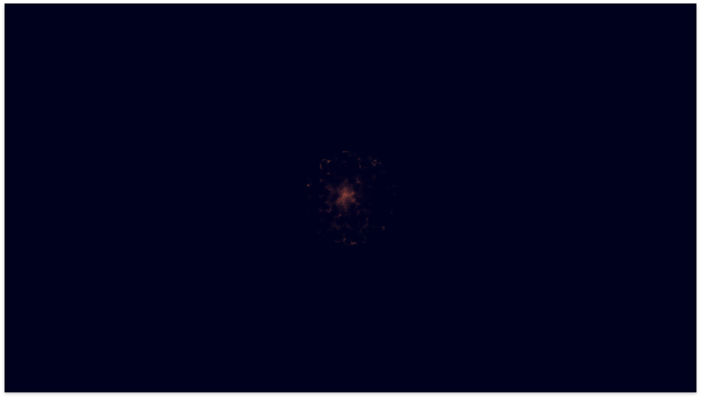
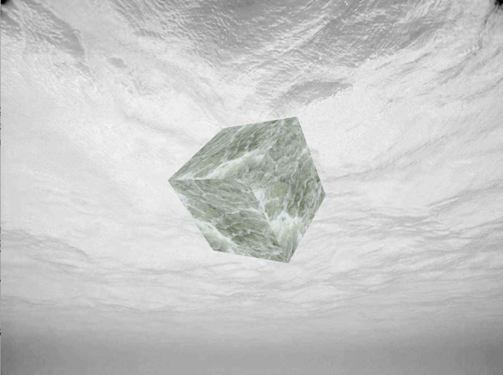
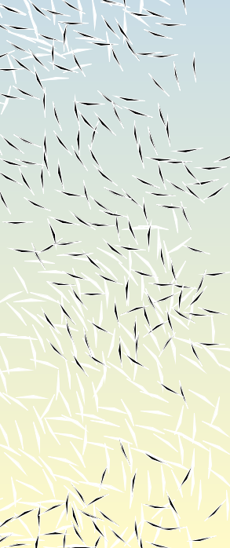
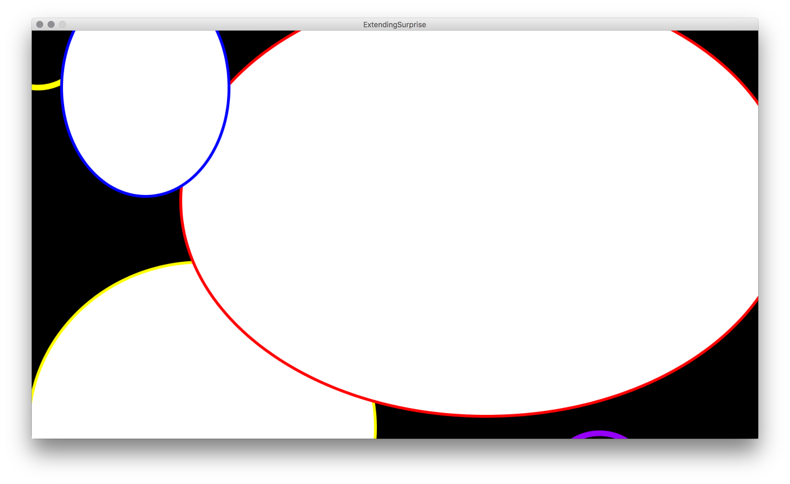

# for each (words)

&rarr; s'initier au design génératif et à la création visuelle par le code. Se concentrer sur des contraintes simples pour travailler en groupe, s'attacher à une méthodologie et approfondir sa connaissance du code.

## Les instructions

* vous êtes un **binôme**
* vous avez une **série de 4 mots** (2 noms, 1 adjéctif, 1 verbe) générée aléatoirement
* vous construisez un **énoncé** à partir de ces mots, cette phrase est le titre de votre rendu et inspire son contenu
* vous utilisez **[Processing](https://processing.org)**
* votre programme n'utilise pas de son (il n'en reçoit pas, il n'en emet pas)
* vous ne rendez votre programme interactif qu'à travers la souris **ou** le clavier
* vous **documentez** votre projet, via un fichier `README` ainsi que des **commentaires** dans le code
* vous utilisez un outil de **gestion de projet**, tel que [Trello](https://trello.com)
* vous êtes libres dans le format de votre rendu (portrait, paysage, carré, 16:9, 16:10, 4:3, ...)
* vous utilisez le français ou l'anglais dans la documentation
* vous utilisez l'anglais dans le code et les noms de fichiers

## Le déroulement

#### Jour 1 (vendredi 14 - 4h)

* présentation design génératif
* présentation du sujet
* travail en autonomie

#### Jour 2 (mardi 18 - 3h)

* point à mi-parcours

#### Jour 3 (vendredi 21 - 3h30)

* bilans individuels
* présentation collective

## Le resultat

### "Le bruit de l'astre symétrique, j'aperçois." — Bernadette Kalaj & Nathan Agranat

> Notre but était de créer un petite interaction entre l'utilisateur et un "astre".
À travers un nuage de points en mouvement nous avons voulus matérialiser un bruit lointain.
Avec la souris, il est possible d'aperçevoir de manière plus précise une zone de l'astre et en découvrir les contours.

<video src="./assets/luminary1.mov" autoplay loop muted max-width="1280" width="100%"></video>

### "Calmement dans une boite tourne la mer" — Marion Robin & Charlène Brun

> Lorsque la sourie est pressée, le Cube tourne sur deux axes, sur ses faces se joue une texture vidéo de vague.
La matière du cube dialogue avec le fond créant un effet de fausse perspective qui met en abime l’immensité de l’océan.

### "La fleur suit le circuit agité" — Nicolas Christmann & Théo Rocquancourt

> L’idée de notre projet était de créer une forme générée de manière aléatoire, la rendant organique. Elle se développe en suivant un circuit à chaque fois unique et se répand jusqu’à recouvrir la totalité de la fenêtre. Nous jouons sur l’attente de la révélation d’un message dissimulé dans l’écran, amenant inévitablement à la déception.

### "L’oiseau est un animal migrateur qui parcours le monde chaque année. Suivant les saisons, il se dirige équitablement vers l’hémisphère nord ou l’hémisphère sud" —  Alice Herbreteau & Alice Sanz

> BIRDS est un script processing basé sur une liste de mot générée aléatoirement. À partir des mots : animal, oiseau, diriger, équitable, nous avons établi l’énoncé suivant : «  L’oiseau est un animal migrateur qui parcours le monde chaque année. Suivant les saisons, il se dirige équitablement vers l’hémisphère nord ou l’hémisphère sud ». Nous voulons créer une image animée comprenant deux groupes avec le même nombre d’éléments , l’un attiré vers le haut de la fenêtre, l’autre vers le bas. Leurs mouvements d’attractions devront rappeler le vol des oiseaux.

### "How to create an extending surprise by running away from immobility?" — Sylvie Nguyen & Clara Shoenlaub

> Have fun!

